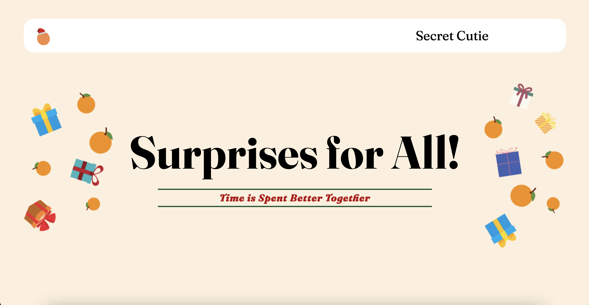

# Secret Cutie
Secret Santa application for gift-giving fun with friends and family. Randomly assigns each 
gifter to a giftee so that everyone gets their fair share of gifts.

**Link to Project:** https://jonac19.github.io/secret-cutie/

## How It's Made:

**Tech Used:** HTML, CSS, JavaScript

## Optimizations

The runtime of the participant matching algorithm was optimized by cutting out unnecessary, repeated calculations. This 

## Lessons Learned

